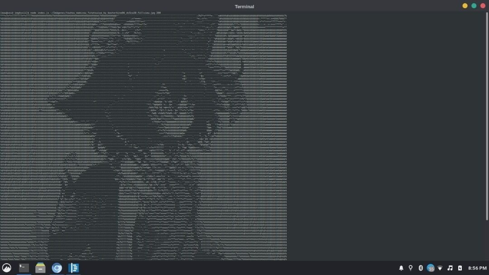

# Image to ASCII art
This code makes any image to ASCII art  
by @Mkefs



It uses [GraphicsMagick](http://www.graphicsmagick.org/) to work, so you need to install it if you doesnt't have it yet.

Then just run:
``` shell
node ./index.js [path_to_image] [width] [bitdepth]
```
Where: 

### **path_to_image**: _string_
Path to the image.  
Eg:
* `./my_image.png`
* `/home/user/Imágenes`
* `C:\users\my_user\Images\my_image.png`

### **width**: _int, optional [default = 40]_
The char width of the image  
Eg: 100, 200, 50, 30

### **bitdepth**: _int < 9, optional [default = 8]_
Idk how explain this, just play with it  
Eg: 1, 2, 3, 4, 5, 6, 7, 8